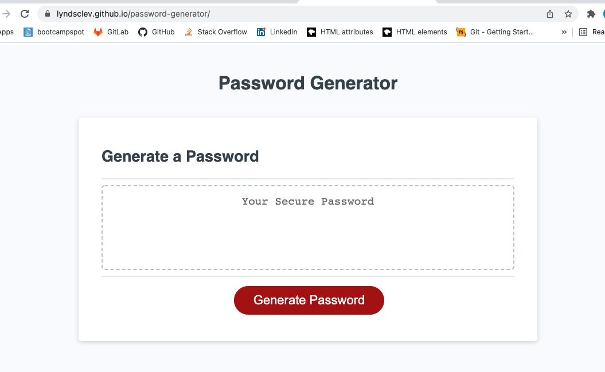
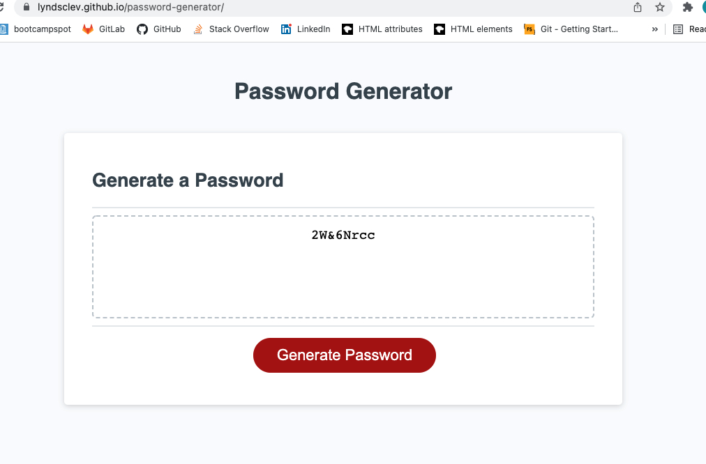

# Password Generator Assignment 

## Purpose

Create a web application that generates a random password based on user input criteria. The password must contain between 8 and 128 characters and at least one of the following: numbers, special characters, lowercase letters, uppercase letters. Password length and type of characters are all chosen by the user. 

## Technologies Used

* HTML (provided)
* CSS (provided)
* JavaScript (starter code provided)

## Deployed Application 

* Repo: https://github.com/lyndsclev/password-generator
* App: https://lyndsclev.github.io/password-generator/ 

## Images

